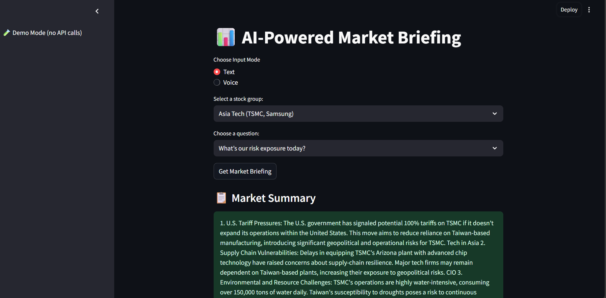

💹 AI Finance Assistant

  🤖 Intelligent multi-agent system that delivers real-time market briefings using voice and text. 
  Built with <strong>Streamlit</strong>, <strong>FastAPI</strong>, <strong>OpenAI</strong>, <strong>LangChain</strong>, <strong>FAISS</strong>, and <strong>Whisper</strong>.

  
  
  
  

📸 Demo Preview

  
  &nbsp;&nbsp;
  

✨ Features

- 🎙️ Text & Voice Input**  
  Interact with the assistant using both text and voice, with audio responses.
  

- 📈 Real-time Stock Market Data**  
  Retrieve live financial data using Yahoo Finance and Alpha Vantage APIs.
  

- 📰 SEC News Scraping & Earnings Analysis**  
  Automatically scrape and analyze financial news and earnings reports.
  

- 🔍 Vector Search with FAISS + Embeddings**  
  Quickly search through embedded financial documents using semantic similarity.
  

- 🧠 Narrative Synthesis using GPT**  
  Generate briefings and insights using LLM-based text synthesis.
  

- 🧪Demo Mode**  
  Explore a limited version of the app without requiring an API key.
  

🛠️ Tech Stack
   

   

Layer     =          Tools & Libraries                          |
UI         =         Streamlit                                  |
Backend API    =     FastAPI, Uvicorn                           |
 LLM Orchestration  = LangChain, Prompt Templates                |
 Embeddings         = Sentence Transformers, FAISS               |
 Data Fetching      = yfinance, Alpha Vantage, BeautifulSoup     |
 Voice Interface    = Whisper (Speech-to-Text), pyttsx3 (Text-to-Speech) 
  

 

